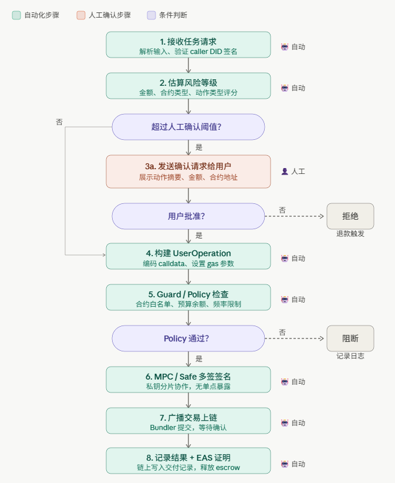

# Agent Wallet 权限策略设计

---

## 任务 1：Agent 链上动作执行流程图

流程图文件：`diagrams/agent-onchain-flow.excalidraw`

可拖拽到 [excalidraw.com](https://excalidraw.com) 打开并编辑。

**步骤归属**：

| 步骤 | 自动化 | 人工确认 |
|------|--------|----------|
| 用户发起任务 | — | 必须 |
| 权限策略检查 | 自动（结果触发确认） | — |
| 人工确认 | — | 必须 |
| 构建交易（data/value/gas） | 自动 | — |
| MPC 签名（多设备协作） | 自动 | — |
| 提交链上（mempool/bundle） | 自动 | — |
| 等待区块确认 | 自动 | — |
| 链上确认写入 | 自动 | — |
| 写日志 / EAS attestation | 自动 | — |

---

## 任务 2：Agent Wallet 权限策略

**场景**：Agent 代表用户执行链上动作，用户设定了预算上限和风险阈值。

### 预算控制

- **每次预算**：单笔交易不超过 $500 USD equivalent
- **日预算**：24小时内累计不超过 $2000
- **超时自动释放**：任务超过 30 分钟未完成，预算自动释放

### 可调用合约

- **白名单**：Uniswap V3 Router、Compound、Coinbase Exchange
- **黑名单**：未经用户明确授权的合约全部禁止
- **版本锁定**：合约地址加入白名单后锁定版本，防止升级后地址变更

### 可执行动作

- **自动执行**：swap（低于 $200）、查询余额、查询历史交易、approve（限额 $100）
- **需人工确认**：swap（高于 $200）、跨链转账、unwrapping ETH、治理投票、合约部署
- **禁止**：直接提取 ETH 到未知地址、多签密钥修改、合约 self-destruct

### 人工确认阈值

- 单笔 swap 超过 $200 → 触发人工确认
- 日累计超过 $2000 → 触发人工确认
- 新合约调用（任意金额）→ 需人工授权一次
- 授权（approve）超过 $100 → 触发人工确认
- 高风险操作（见禁止列表）→ 全部需确认

### 撤销方式

1. **即时撤销**：用户在 dashboard 点击"撤销 Agent 权限"，立即生效，链上签名撤销
2. **定时撤销**：预设 24 小时后自动失效，需用户主动续期
3. **条件撤销**：链上触发（例如 gas 费异常、或某一合约出现 rug pull），自动暂停
4. **Pact 失效**：Cobo CAW 模式的任务级授权，任务完成后权限自然失效

### 日志记录

- **链上日志**：每次操作记录到 Event Log，可查 tx hash
- **EAS attestation**：关键操作附带链上证明（时间戳 + 输入输出 hash）
- **离线日志**：本地 SQLite，记录 task_id / capability / 结果 / gas 消耗 / 执行时间
- **审计接口**：用户随时可导出完整操作历史

### 失败处理

- **超出日预算**：拒绝执行，发送 Telegram 预警
- **RPC 节点超时**：重试 3 次（指数退避），失败后通知用户
- **交易失败（revert）**：记录 revert 原因，退还预算份额，通知用户
- **合约 rug pull 检测**：立即停止该合约一切操作，冻结相关权限
- **MPC 签名失败**：触发多签恢复流程，通知所有签名人
- **Agent 崩溃**：链上 escrow 超时自动退款，用户重新授权

---

## 任务 3：ERC-4337、Safe、Guard/Policy 为什么重要

### ERC-4337 — 账户抽象

**解决的问题**：EOA（外部账户）只能发送原生交易，无法自定义逻辑。

- 以前：Agent 要执行链上操作，必须用 EOA 私钥签名，私钥泄露 = 资产丢失
- ERC-4337 后：智能合约账户（Smart Account）可以定义自己的执行逻辑：
  - **Session Key**：为特定场景生成临时授权密钥，用完即废，不需要暴露主私钥
  - **Paymaster**：让别人代付 gas，Agent 执行任务不需要用户有 ETH
  - **聚合签名**：多个签名打包成一个，降低 cost

**为什么重要**：Agent 发起的链上动作从此不需要用户直接暴露私钥——通过 Smart Account 的 session key 和 paymaster，Agent 可以在受限范围内代为执行，权限可回收。

---

### Safe — 多签钱包

**解决的问题**：单点私钥失效导致资产永久丢失。

- **多签机制**：2/3、3/5 等多签，需要多个私钥授权才能执行操作
- **模块（Module）**：Safe 可以挂载执行策略模块，比如定时释放津贴、自动化 DeFi 操作、紧急暂停开关

**为什么重要**：机构级资产管理必须有多签——防止内部恶意行为、防止单点被攻击、防止误操作。大额资产不能交给单一 Agent 控制。

---

### Guard / Policy 机制

**解决的问题**：Agent 执行链上操作时，"谁决定了什么动作可以执行"。

- **Guard**：Safe 的插件，在每次交易执行前检查条件（如金额上限、目标地址白名单、每天调用次数上限）
- **Policy Engine**：Coinbase / Cobo 这类平台提供的交易策略引擎，类似防火墙规则：
  - "单笔超过 $1000 需要多签审批"
  - "禁止调用未知合约"
  - "检测到异常大额转账立即冻结"

**为什么重要**：Agent 本身没有道德判断——它会忠实地执行指令，哪怕指令是错的。Guard/Policy 提供了执行前的安全门，防止 Agent 在失控或被劫持的情况下造成不可逆损失。

---

**三者关系**：

- **Safe** 提供多签账户基础 + 可插拔 Guard
- **ERC-4337** 提供 Smart Account 逻辑（session key、paymaster、聚合签名）
- **Guard/Policy** 在 Safe 或 ERC-4337 账户上叠加细粒度执行控制

没有这三层，Agent 的链上操作就是裸奔——私钥暴露、权限无边界、失败无恢复。